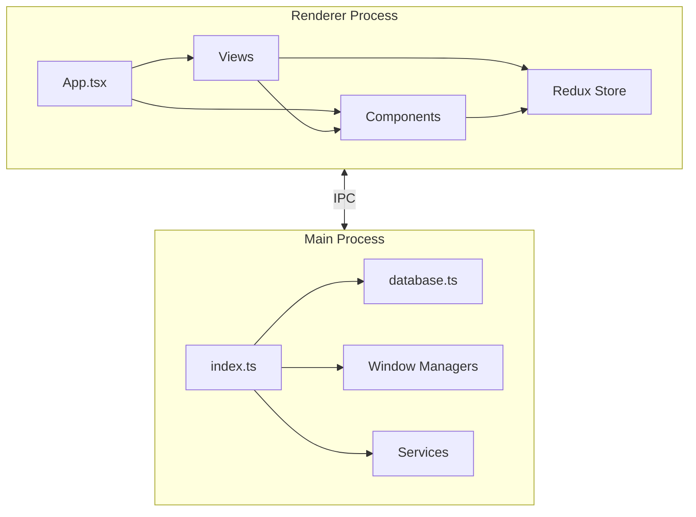
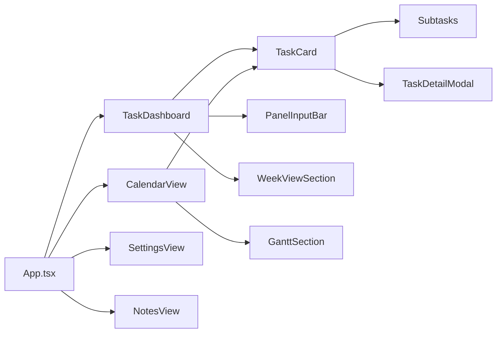

# 井然 (JingRanTodo) 详细设计文档

## 文档信息
- **版本**: 1.0.0
- **更新日期**: 2025-12-28
- **产品名称**: ZenHubBoard
- **技术栈**: Electron + React + TypeScript + Tailwind CSS

---

## 目录

1. [系统架构](#1-系统架构)
   - 1.1 [整体架构](#11-整体架构)
   - 1.2 [技术选型](#12-技术选型)
   - 1.3 [进程通信](#13-进程通信)

2. [项目目录结构](#2-项目目录结构)
   - 2.1 [完整目录树](#21-完整目录树)
   - 2.2 [模块依赖关系](#22-模块依赖关系)

3. [数据模型设计](#3-数据模型设计)
   - 3.1 [数据库表结构](#31-数据库表结构)
   - 3.2 [接口类型定义](#32-接口类型定义)

4. [Main 进程模块设计](#4-main-进程模块设计)
   - 4.1 [入口模块 (index.ts)](#41-入口模块-indexts)
   - 4.2 [数据库模块 (database.ts)](#42-数据库模块-databasets)
   - 4.3 [窗口管理模块](#43-窗口管理模块)
   - 4.4 [AI 服务模块](#44-ai-服务模块)
   - 4.5 [系统功能模块](#45-系统功能模块)

5. [Renderer 渲染层设计](#5-renderer-渲染层设计)
   - 5.1 [应用入口 (App.tsx)](#51-应用入口-apptsx)
   - 5.2 [视图组件设计](#52-视图组件设计)
   - 5.3 [UI 组件设计](#53-ui-组件设计)
   - 5.4 [状态管理设计](#54-状态管理设计)

6. [UI 设计规范](#6-ui-设计规范)
   - 6.1 [视觉设计系统](#61-视觉设计系统)
   - 6.2 [组件规范](#62-组件规范)

7. [接口设计](#7-接口设计)
   - 7.1 [IPC 通信接口](#71-ipc-通信接口)
   - 7.2 [数据库 API](#72-数据库-api)

---

## 1. 系统架构

### 1.1 整体架构

```
┌─────────────────────────────────────────────────────────────┐
│                        ZenHubBoard                          │
├─────────────────────────────────────────────────────────────┤
│                                                             │
│  ┌─────────────────────────────────────────────────────┐   │
│  │                   Renderer Process                   │   │
│  │  ┌───────────────────────────────────────────────┐  │   │
│  │  │                   React App                    │  │   │
│  │  │  ┌─────────┐  ┌─────────┐  ┌─────────────┐   │  │   │
│  │  │  │  Views  │  │Components│  │Redux Store │   │  │   │
│  │  │  └─────────┘  └─────────┘  └─────────────┘   │  │   │
│  │  └───────────────────────────────────────────────┘  │   │
│  └─────────────────────────────────────────────────────┘   │
│                            ▲                                │
│                            │ IPC                            │
│                            ▼                                │
│  ┌─────────────────────────────────────────────────────┐   │
│  │                    Main Process                      │   │
│  │  ┌──────────┐ ┌──────────┐ ┌──────────┐            │   │
│  │  │ Database │ │ Windows  │ │ Services │            │   │
│  │  │ (SQLite) │ │ Manager  │ │ (AI/...)│            │   │
│  │  └──────────┘ └──────────┘ └──────────┘            │   │
│  └─────────────────────────────────────────────────────┘   │
│                                                             │
└─────────────────────────────────────────────────────────────┘
```

### 1.2 技术选型

| 层级 | 技术 | 版本 | 用途 |
|------|------|------|------|
| 框架 | Electron | ^28.0.0 | 桌面应用框架 |
| 前端 | React | ^18.2.0 | UI 框架 |
| 类型 | TypeScript | ^5.3.3 | 类型安全 |
| 样式 | Tailwind CSS | ^3.3.6 | 原子化 CSS |
| 状态 | Redux Toolkit | ^2.0.1 | 状态管理 |
| 拖放 | @dnd-kit | ^6.1.0 | 拖放功能 |
| 数据库 | sql.js | ^1.13.0 | 纯 JS SQLite |
| 图标 | lucide-react | ^0.294.0 | 图标库 |
| 日期 | date-fns | ^4.1.0 | 日期处理 |
| 国际化 | i18next | ^23.7.11 | 多语言支持 |
| 构建 | Vite | ^5.0.8 | 构建工具 |
| Excel | xlsx | ^0.18.5 | Excel 解析 |
| NLP | chrono-node | ^2.9.0 | 自然语言日期解析 |
| Markdown | react-markdown | ^10.1.0 | Markdown 渲染 |
| 颜色选择 | react-colorful | ^5.6.1 | 颜色选择器 |
| 加密 | - | 内置 | API Key 加密 |
| Windows API | koffi | ^2.14.1 | 原生 Win32 调用 |

### 1.3 进程通信

```
┌────────────────┐              ┌────────────────┐
│   Renderer     │◄────IPC─────►│     Main       │
│   (React)      │              │   (Node.js)    │
└────────────────┘              └────────────────┘
        │                               │
        ▼                               ▼
   window.electronAPI          ipcMain.handle()
        │                               │
        └───────── contextBridge ───────┘
```

---

## 2. 项目目录结构

### 2.1 完整目录树

```
ZenHubBoard/
├── .git/                              # Git 版本控制
├── .gitignore                         # Git 忽略配置
│
├── data/                              # 运行时数据目录
│   └── zenhub.db                      # SQLite 数据库文件
│
├── public/                            # 静态资源（构建时复制）
│   ├── holiday/                       # 节假日数据
│   │   ├── china_holidays.json        # 中国节假日
│   │   └── ...
│   ├── images/                        # 图片资源
│   ├── notes/                         # 笔记模板
│   │   ├── template1.md
│   │   └── ...
│   ├── task/                          # 任务模板
│   │   └── 《任务导入模板.xlsx》       # Excel 导入模板
│   ├── icon.ico                       # Windows 图标
│   ├── icon.png                       # PNG 图标
│   └── icon.svg                       # SVG 图标
│
├── scripts/                           # 构建脚本
│   └── installer.nsh                  # NSIS 安装脚本
│
├── src/                               # 源代码
│   ├── main/                          # Electron Main 进程
│   │   ├── capsule/                   # AI 闪念胶囊
│   │   │   ├── aiService.ts           # AI 服务封装
│   │   │   ├── localParser.ts         # 本地解析器
│   │   │   └── parseService.ts        # 解析服务入口
│   │   ├── excel/                     # Excel 导入
│   │   │   ├── excelParser.ts         # Excel 解析
│   │   │   └── importHandler.ts       # IPC 处理器
│   │   ├── utils/                     # 工具函数
│   │   │   └── crypto.ts              # 加密工具
│   │   ├── backup.ts                  # 备份还原
│   │   ├── capsuleWindow.ts           # 胶囊窗口
│   │   ├── cardWindow.ts              # 卡片浮窗
│   │   ├── database.ts                # 数据库操作
│   │   ├── desktopAttach.ts           # 桌面嵌入
│   │   ├── index.ts                   # 入口文件
│   │   ├── noteWindow.ts              # 笔记窗口
│   │   ├── notes.ts                   # 笔记操作
│   │   ├── recurrence.ts              # 周期任务
│   │   ├── reminder.ts                # 提醒系统
│   │   ├── shortcuts.ts               # 快捷键
│   │   ├── sql.js.d.ts                # 类型定义
│   │   ├── tray.ts                    # 系统托盘
│   │   ├── updater.ts                 # 自动更新
│   │   └── weekViewWindow.ts          # 周视图窗口
│   │
│   ├── preload/                       # 预加载脚本
│   │   └── index.ts                   # contextBridge 暴露 API
│   │
│   └── renderer/                      # 渲染进程
│       ├── components/                # UI 组件
│       │   ├── AIExtensionCenter.tsx  # AI 扩展中心
│       │   ├── AvatarUploadModal.tsx  # 头像上传
│       │   ├── CalendarContextMenu.tsx # 日历右键菜单
│       │   ├── ConfirmModal.tsx       # 确认对话框
│       │   ├── CustomPanelGrid.tsx    # 自定义面板网格
│       │   ├── DesktopWidget.tsx      # 桌面挂件
│       │   ├── ErrorBoundary.tsx      # 错误边界
│       │   ├── ExcelImportModal.tsx   # Excel 导入
│       │   ├── GlassPanel.tsx         # 毛玻璃面板
│       │   ├── InputModal.tsx         # 输入弹窗
│       │   ├── MarkdownRenderer.tsx   # Markdown 渲染
│       │   ├── MarkdownToolbar.tsx    # Markdown 工具栏
│       │   ├── PanelInputBar.tsx      # 面板输入栏
│       │   ├── PomodoroTimer.tsx      # 番茄钟
│       │   ├── SectionHeader.tsx      # 区块标题
│       │   ├── ShortcutRecorder.tsx   # 快捷键录制
│       │   ├── Sidebar.tsx            # 侧边栏
│       │   ├── SmartChip.tsx          # 智能标签
│       │   ├── TaskCard.tsx           # 任务卡片
│       │   ├── TaskDetailModal.tsx    # 任务详情弹窗
│       │   ├── TaskPanel.tsx          # 任务面板
│       │   ├── TaskPreviewCard.tsx    # 任务预览
│       │   ├── WeekViewSection.tsx    # 周视图区块
│       │   ├── WeekViewWidget.tsx     # 周视图挂件
│       │   └── index.ts               # 组件导出
│       │
│       ├── hooks/                     # 自定义 Hooks
│       │   └── useRedux.ts            # Redux Hooks
│       │
│       ├── i18n/                      # 国际化
│       │   ├── index.ts               # i18n 配置
│       │   ├── en.json                # 英文
│       │   └── zh.json                # 中文
│       │
│       ├── services/                  # 服务层
│       │   └── taskService.ts         # 任务服务
│       │
│       ├── store/                     # Redux Store
│       │   ├── index.ts               # Store 配置
│       │   ├── notesSlice.ts          # 笔记状态
│       │   ├── pomodoroSlice.ts       # 番茄钟状态
│       │   ├── recurringSlice.ts      # 周期任务状态
│       │   ├── settingsSlice.ts       # 设置状态
│       │   └── tasksSlice.ts          # 任务状态
│       │
│       ├── styles/                    # 样式
│       │   └── index.css              # 全局样式
│       │
│       ├── utils/                     # 工具函数
│       │
│       ├── views/                     # 页面视图
│       │   ├── CalendarView.tsx       # 日历视图
│       │   ├── CapsuleView.tsx        # 闪念胶囊
│       │   ├── NoteFloatingView.tsx   # 笔记浮窗
│       │   ├── NotesView.tsx          # 笔记列表
│       │   ├── RecurringTaskView.tsx  # 周期任务
│       │   ├── SettingsView.tsx       # 设置页面
│       │   └── TaskDashboard.tsx      # 任务仪表盘
│       │
│       ├── App.tsx                    # 应用根组件
│       ├── index.tsx                  # 渲染入口
│       └── vite-env.d.ts              # Vite 类型定义
│
├── dist/                              # Vite 构建输出
├── dist-electron/                     # Electron 构建输出
├── release/                           # 打包发布目录
│
├── index.html                         # HTML 入口
├── package.json                       # NPM 配置
├── package-lock.json                  # 依赖锁定
├── postcss.config.js                  # PostCSS 配置
├── tailwind.config.js                 # Tailwind 配置
├── tsconfig.json                      # TypeScript 配置
├── tsconfig.node.json                 # Node TS 配置
└── vite.config.ts                     # Vite 配置
```

### 2.2 模块依赖关系



---

## 3. 数据模型设计

### 3.1 数据库表结构

#### tasks 表

```sql
CREATE TABLE tasks (
    id TEXT PRIMARY KEY,              -- UUID
    title TEXT NOT NULL,              -- 任务标题
    description TEXT,                 -- 任务描述
    status TEXT DEFAULT 'todo',       -- 状态: todo | done
    priority TEXT DEFAULT 'medium',   -- 优先级
    is_pinned INTEGER DEFAULT 0,      -- 是否置顶
    start_date TEXT,                  -- 开始日期 (YYYY-MM-DD)
    due_date TEXT,                    -- 截止日期 (YYYY-MM-DD)
    time_of_day TEXT,                 -- 时段: morning | afternoon | evening
    reminder_enabled INTEGER DEFAULT 0, -- 是否开启提醒
    reminder_date TEXT,               -- 提醒日期
    reminder_hour INTEGER,            -- 提醒小时
    reminder_minute INTEGER,          -- 提醒分钟
    reminder_sent INTEGER DEFAULT 0,  -- 提醒是否已发送
    auto_generate_daily INTEGER DEFAULT 0, -- 持续任务每日生成
    is_recurring INTEGER DEFAULT 0,   -- 是否周期任务
    recurrence_rule TEXT,             -- 周期规则 (JSON)
    parent_id TEXT,                   -- 所属面板 ID
    rank INTEGER DEFAULT 0,           -- 排序值
    created_at TEXT,                  -- 创建时间 (ISO)
    updated_at TEXT                   -- 更新时间 (ISO)
)
```

#### subtasks 表

```sql
CREATE TABLE subtasks (
    id TEXT PRIMARY KEY,
    task_id TEXT NOT NULL,
    title TEXT NOT NULL,
    description TEXT,
    priority TEXT DEFAULT 'medium',
    completed INTEGER DEFAULT 0,
    "order" INTEGER DEFAULT 0,
    reminder_enabled INTEGER DEFAULT 0,
    reminder_date TEXT,
    reminder_hour INTEGER,
    reminder_minute INTEGER,
    reminder_sent INTEGER DEFAULT 0,
    FOREIGN KEY (task_id) REFERENCES tasks(id)
)
```

#### custom_panels 表

```sql
CREATE TABLE custom_panels (
    id TEXT PRIMARY KEY,
    title TEXT NOT NULL,
    is_expanded INTEGER DEFAULT 1,
    width INTEGER DEFAULT 300,
    height INTEGER DEFAULT 400,
    sort_order INTEGER DEFAULT 0,
    copy_format TEXT DEFAULT 'text',       -- 复制格式: text | json | markdown
    copy_template_task TEXT,               -- 任务模板
    copy_template_subtask TEXT             -- 子任务模板
)
```

#### recurring_templates 表

```sql
CREATE TABLE recurring_templates (
    id TEXT PRIMARY KEY,
    title TEXT NOT NULL,
    description TEXT,
    priority TEXT DEFAULT 'medium',
    recurrence_type TEXT NOT NULL,    -- daily | weekly | monthly
    recurrence_config TEXT,           -- JSON 配置
    is_enabled INTEGER DEFAULT 1,
    last_generated_date TEXT,
    created_at TEXT,
    updated_at TEXT
)
```

#### ai_providers 表

```sql
CREATE TABLE ai_providers (
    id TEXT PRIMARY KEY,
    type TEXT NOT NULL,               -- gemini | openai_compatible
    name TEXT NOT NULL,
    enabled INTEGER DEFAULT 0,
    base_url TEXT,
    api_key TEXT,                     -- 加密存储
    model_name TEXT,
    system_prompt TEXT,
    temperature REAL DEFAULT 0.7,
    max_tokens INTEGER DEFAULT 2048,
    is_default INTEGER DEFAULT 0
)
```

#### notes 表

```sql
CREATE TABLE notes (
    id TEXT PRIMARY KEY,
    title TEXT NOT NULL,
    content TEXT,
    category TEXT,
    color TEXT,
    is_pinned INTEGER DEFAULT 0,
    is_floating INTEGER DEFAULT 0,       -- 是否浮动窗口打开
    show_on_dashboard INTEGER DEFAULT 0, -- 是否在主页显示
    dashboard_order INTEGER DEFAULT 0,   -- 主页排序位置
    position_x INTEGER,                  -- 浮动窗口 X 坐标
    position_y INTEGER,                  -- 浮动窗口 Y 坐标
    width INTEGER DEFAULT 320,           -- 窗口宽度
    height INTEGER DEFAULT 400,          -- 窗口高度
    z_index INTEGER DEFAULT 1,           -- 窗口层级
    created_at TEXT,
    updated_at TEXT
)
```


#### settings 表

```sql
CREATE TABLE settings (
    key TEXT PRIMARY KEY,
    value TEXT
)
```

### 3.2 接口类型定义

#### Task 接口

```typescript
interface Task {
    id: string
    title: string
    description?: string
    status: 'todo' | 'done'
    priority: 'very-low' | 'low' | 'medium' | 'high' | 'very-high'
    is_pinned: boolean
    start_date: string | null       // YYYY-MM-DD
    due_date: string | null         // YYYY-MM-DD
    time_of_day?: 'morning' | 'afternoon' | 'evening'
    reminder_enabled?: boolean
    reminder_date?: string
    reminder_hour?: number
    reminder_minute?: number
    reminder_sent?: boolean
    auto_generate_daily?: boolean
    is_recurring: boolean
    recurrence_rule?: string
    parent_id?: string              // 面板 ID
    rank?: number
    created_at: string
    updated_at: string
    subtasks: Subtask[]
}
```

#### Subtask 接口

```typescript
interface Subtask {
    id: string
    task_id: string
    title: string
    description?: string
    priority?: 'very-low' | 'low' | 'medium' | 'high' | 'very-high'
    completed: boolean
    order: number
    reminder_enabled?: boolean
    reminder_date?: string
    reminder_hour?: number
    reminder_minute?: number
    reminder_sent?: boolean
}
```

#### AIProviderConfig 接口

```typescript
interface AIProviderConfig {
    id: string
    type: 'gemini' | 'openai_compatible'
    name: string
    enabled: boolean
    baseUrl: string
    apiKey?: string
    modelName: string
    systemPrompt?: string
    temperature: number
    maxTokens: number
    isDefault: boolean
}
```

#### Note 接口

```typescript
interface Note {
    id: string
    title: string
    content: string
    isPinned: boolean
    isFloating: boolean
    showOnDashboard: boolean        // 是否在主页显示
    dashboardOrder: number          // 主页排序位置（全局索引）
    position?: { x: number, y: number }
    width: number
    height: number
    zIndex: number
    mode: 'edit' | 'preview'
    updatedAt: number
}
```

---

## 4. Main 进程模块设计

### 4.1 入口模块 (index.ts)

**职责**: 应用生命周期管理、IPC 处理器注册、窗口创建

**主要函数**:

| 函数 | 描述 |
|------|------|
| `createMainWindow()` | 创建主窗口 |
| `setupIPC()` | 注册所有 IPC 处理器 |
| `broadcastTaskUpdate()` | 广播任务更新事件 |
| `runScheduler()` | 运行周期任务调度器 |

**生命周期**:

```
app.whenReady()
    ├── initDatabase()
    ├── initBackupSystem()
    ├── initReminderSystem()
    ├── runScheduler()
    ├── setupIPC()
    ├── createMainWindow()
    ├── initCapsule()
    └── initUpdater()
```

### 4.2 数据库模块 (database.ts)

**职责**: 所有数据持久化操作

**主要函数分类**:

| 类别 | 函数 |
|------|------|
| 初始化 | `initDatabase()`, `createTables()`, `saveDatabase()` |
| Tasks CRUD | `getAllTasks()`, `getTask()`, `createTask()`, `updateTask()`, `deleteTask()` |
| Subtasks | `getSubtasks()`, `createSubtask()`, `updateSubtask()`, `deleteSubtask()` |
| Panels | `getAllPanels()`, `createPanel()`, `updatePanel()`, `deletePanel()` |
| 周期任务 | `getAllRecurringTemplates()`, `createRecurringTemplate()`, `checkAndGenerateRecurringTasks()` |
| AI Provider | `getAllAIProviders()`, `createAIProvider()`, `updateAIProvider()`, `deleteAIProvider()` |
| 设置 | `getSettings()`, `setSetting()` |

### 4.3 窗口管理模块

| 模块 | 文件 | 描述 |
|------|------|------|
| 卡片浮窗 | `cardWindow.ts` | 独立任务面板窗口，支持桌面嵌入 |
| 笔记窗口 | `noteWindow.ts` | 独立笔记编辑窗口 |
| 胶囊窗口 | `capsuleWindow.ts` | 快速输入窗口 |
| 周视图窗口 | `weekViewWindow.ts` | 浮动周视图挂件 |
| 桌面嵌入 | `desktopAttach.ts` | Windows 桌面附着功能 |

### 4.4 AI 服务模块

```
capsule/
├── parseService.ts      # 统一解析入口
│   ├── useLocalParser   # 本地解析器
│   └── useAIParser      # AI 解析器
├── localParser.ts       # chrono-node 本地解析
└── aiService.ts         # AI API 调用
```

**解析流程**:

```
用户输入 → parseService
            ├── 优先使用 localParser
            └── 回退到 aiService (如配置)
                  └── 调用 Gemini/OpenAI API
```

### 4.5 系统功能模块

| 模块 | 描述 |
|------|------|
| `reminder.ts` | 任务提醒，使用 Electron Notification |
| `recurrence.ts` | 周期任务调度和生成 |
| `backup.ts` | 数据库备份和还原 |
| `shortcuts.ts` | 全局快捷键注册 |
| `tray.ts` | 系统托盘管理 |
| `updater.ts` | 应用自动更新 |

---

## 5. Renderer 渲染层设计

### 5.1 应用入口 (App.tsx)

**职责**: 路由管理、主题切换、全局状态

**主要功能**:
- 导航（Sidebar 驱动）
- 主题背景动态计算
- 任务详情弹窗管理
- 浮动窗口控制

### 5.2 视图组件设计

| 视图 | 文件 | 描述 |
|------|------|------|
| 任务仪表盘 | `TaskDashboard.tsx` | 主页，今日任务 + 自定义面板 |
| 日历视图 | `CalendarView.tsx` | 周视图/月视图 + 甘特图 |
| 设置 | `SettingsView.tsx` | 外观/AI/快捷键/数据设置 |
| 笔记 | `NotesView.tsx` | 笔记列表管理 |
| 周期任务 | `RecurringTaskView.tsx` | 周期模板管理 |
| 闪念胶囊 | `CapsuleView.tsx` | 快速输入入口 |

### 5.3 UI 组件设计

**核心组件层级**:

```
GlassPanel (基础容器)
├── TaskCard (任务卡片)
│   └── Subtask items
├── NotePanel (笔记卡片)           ← 新增
│   ├── MarkdownToolbar
│   └── MarkdownRenderer
├── PanelInputBar (输入栏)
├── SectionHeader (标题栏)
├── AddPanelTypeModal (卡片类型选择) ← 新增
├── CopyFormatSettingsModal (复制格式设置) ← 新增
└── TaskDetailModal (详情弹窗)
```

**组件通信**:

```
TaskDashboard
├── DroppablePanel (可放置任务面板)
│   └── SortableTaskCard (可排序任务卡片)
│       └── TaskCard
├── NotePanel (笔记卡片)            ← 新增：直接作为 CustomPanelGrid 的子元素
├── WeekViewSection (周视图)
├── CustomPanelGrid (自定义面板网格)
│   └── SortablePanel (混合排序容器)  ← 支持任务卡片与笔记卡片混排
└── AddPanelTypeModal (卡片类型选择弹窗) ← 新增
```

#### NotePanel 组件（新增）

**文件**: `src/renderer/components/NotePanel.tsx`

**Props**:
```typescript
interface NotePanelProps {
    note: Note
    onRemove: () => void
    onOpenFloatWindow: () => void
    onCloseFloatWindow: () => void
    isFloatWindowOpen: boolean
    opacity?: number
    onContentChange: (noteId: string, content: string) => void
    onTitleChange: (noteId: string, title: string) => void
    dragListeners?: any      // 拖拽监听器
    isDragging?: boolean     // 拖拽状态
}
```

**功能**:
- 编辑/预览模式切换
- Markdown 实时渲染
- 自动保存（1秒防抖）
- 标题编辑
- 浮动窗口控制

#### AddPanelTypeModal 组件（新增）

**文件**: `src/renderer/components/AddPanelTypeModal.tsx`

**Props**:
```typescript
interface AddPanelTypeModalProps {
    isOpen: boolean
    onClose: () => void
    onSelectTaskPanel: () => void
    onSelectNotePanel: (noteId: string) => void
    onCreateNote?: (title: string) => Promise<string | null>
    notes: Note[]
    existingNotePanelIds: string[]
}
```

**功能**:
- 卡片类型选择（任务/笔记）
- 笔记列表搜索和选择
- 快速新建笔记

#### CopyFormatSettingsModal 组件（新增）

**文件**: `src/renderer/components/CopyFormatSettingsModal.tsx`

**Props**:
```typescript
interface CopyFormatSettingsModalProps {
    isOpen: boolean
    onClose: () => void
    onSave: (settings: CopyFormatSettings) => void
    initialSettings: CopyFormatSettings
    title?: string
}

interface CopyFormatSettings {
    copyFormat: 'text' | 'json' | 'markdown'
    copyTemplateTask: string
    copyTemplateSubtask: string
}
```

**功能**:
- 复制格式选择（Text/JSON/Markdown）
- 任务模板自定义编辑
- 子任务模板自定义编辑
- 重置为默认模板
- 每个面板独立配置

**模板变量**:
- `{{chinese_index}}`: 中文序号
- `{{index}}`: 数字序号
- `{{title}}`: 任务标题
- `{{description}}`: 任务描述
- `{{subtasks}}`: 子任务内容

**调用入口**:
- 任务面板底部⚙️设置图标
- 日历视图右键菜单"复制格式设置"


### 5.4 状态管理设计

**Store 结构**:

```typescript
interface RootState {
    tasks: TasksState
    notes: NotesState
    settings: SettingsState
    recurring: RecurringState
    pomodoro: PomodoroState
}
```

**tasksSlice 核心 Actions**:

```typescript
// Async Thunks
fetchTasks()        // 加载所有任务
createTask()        // 创建任务
updateTask()        // 更新任务
deleteTask()        // 删除任务
createSubtask()     // 创建子任务
updateSubtask()     // 更新子任务
deleteSubtask()     // 删除子任务

// Sync Reducers
moveTask()          // 拖拽移动（乐观更新）
toggleTaskPin()     // 切换置顶
```

---

## 6. UI 设计规范

### 6.1 视觉设计系统

#### 调色板

| 用途 | 颜色 | Tailwind 类 |
|------|------|-------------|
| 主色 | 蓝色 | `blue-600` / `blue-500` (hover) |
| 背景 | 渐变 | `indigo-300` → `purple-300` |
| Glass 容器 | 白色透明 | `bg-white/xx` |
| 高优先级 | 红色 | `bg-red-500` |
| 中优先级 | 黄色 | `bg-yellow-400` |
| 低优先级 | 绿色 | `bg-green-400` |
| 标题文字 | 深灰 | `text-gray-800` |
| 正文文字 | 中灰 | `text-gray-700` |
| 次要文字 | 浅灰 | `text-gray-500` |

#### 毛玻璃层级

| 层级 | 用途 | 样式 |
|------|------|------|
| Level 1 | 侧边栏 | `opacity-60`, `backdrop-blur-xl` |
| Level 2 | 主面板 | `opacity-50` |
| Level 3 | 普通卡片 | `bg-white/20`, `border-white/10` |
| Level 3+ | 置顶卡片 | `bg-white/50`, `shadow-lg` |
| Level 4 | 弹窗浮层 | `opacity-90`, `shadow-2xl` |

### 6.2 组件规范

#### TaskCard (任务卡片)

- 触发器: 点击展开/折叠子任务
- 优先级: 左侧 4px 彩色竖条
- 悬停: 显示操作按钮，轻微上浮
- 完成态: 删除线 + 透明度降低

#### PanelInputBar (输入栏)

- 默认态: 透明背景，仅显示占位符
- 悬停态: `bg-white/10`，显示操作按钮
- 回车提交

#### GlassPanel (毛玻璃面板)

- 统一圆角: `rounded-2xl`
- 边框: `border border-white/20`
- 阴影: 根据层级变化

---

## 7. 接口设计

### 7.1 IPC 通信接口

#### 任务相关

```typescript
// 渲染进程调用
window.electronAPI.getAllTasks(): Promise<Task[]>
window.electronAPI.createTask(task: Partial<Task>): Promise<Task>
window.electronAPI.updateTask(task: Task): Promise<Task>
window.electronAPI.deleteTask(id: string): Promise<boolean>

// 主进程事件
'tasks-updated': () => void  // 任务更新广播
```

#### 窗口相关

```typescript
window.electronAPI.openFloatWindow(panelId: string): void
window.electronAPI.closeFloatWindow(panelId: string): void
window.electronAPI.setAlwaysOnTop(flag: boolean): void
window.electronAPI.minimizeWindow(): void
window.electronAPI.maximizeWindow(): void
window.electronAPI.closeWindow(): void
```

#### 设置相关

```typescript
window.electronAPI.getSettings(): Promise<Record<string, any>>
window.electronAPI.setSetting(key: string, value: any): Promise<boolean>
```

### 7.2 数据库 API

#### CRUD 操作模板

```typescript
// 创建
function createXxx(data: Xxx): Xxx {
    db.run(`INSERT INTO xxx (...) VALUES (...)`)
    saveDatabase()
    return data
}

// 读取
function getXxx(id: string): Xxx | undefined {
    const result = db.exec(`SELECT * FROM xxx WHERE id = ?`)
    return queryToObjects(result)[0]
}

// 更新
function updateXxx(data: Xxx): Xxx {
    db.run(`UPDATE xxx SET ... WHERE id = ?`)
    saveDatabase()
    return data
}

// 删除
function deleteXxx(id: string): boolean {
    db.run(`DELETE FROM xxx WHERE id = ?`)
    saveDatabase()
    return true
}
```

---

## 附录

### A. 文件大小统计

| 文件 | 大小 | 说明 |
|------|------|------|
| `TaskDetailModal.tsx` | 70.6KB | 最大组件，功能最复杂 |
| `SettingsView.tsx` | 54.0KB | 设置页面，包含多个 tab |
| `CalendarView.tsx` | 49.7KB | 日历视图，含甘特图 |
| `database.ts` | 49.2KB | 数据库核心，51 个函数 |
| `TaskDashboard.tsx` | 37.7KB | 主页仪表盘 |

### B. 依赖关系图


